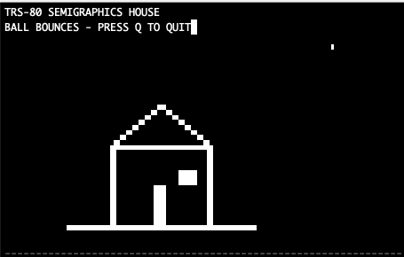
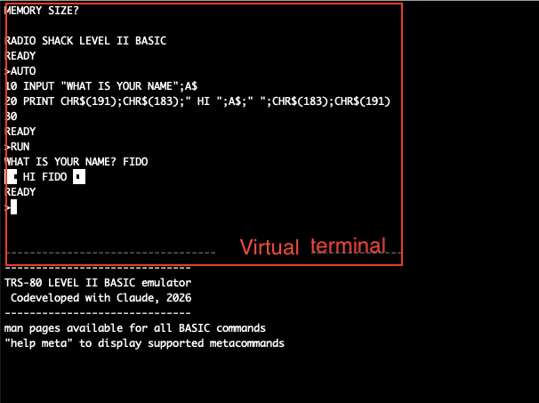

# trs80basic



*Semigraphics drawn with `SET` on the 128x48 grid — `programs/demos/demo_graphics.bas`.*



*The simulated 64x16 screen: answer MEMORY SIZE?, type a program, RUN it.*

## What it is

A TRS-80 Model I/III LEVEL II BASIC interpreter — the 1978 Radio Shack dialect,
with its 64x16 screen and semigraphics, cassette (`CLOAD`/`CSAVE` as text
files, `SYSTEM` for object files), Disk BASIC file I/O, and an `OLLAMA` channel for talking to a local
LLM from BASIC. It runs `.bas` listings interactively at a `READY` prompt or
non-interactively from a script. It is a single GNU awk script with no build
step; it writes only the files your BASIC program tells it to.

## Very brief FAQ:
- Why awk??\
A. It's funny, and there's an inside joke about it.\
B. I wanted to see if Claude could deal with such a ridiculous request.  Its first pass included everything I had asked for, which was probably around 90% of BASIC.

- Does it run Dancing Demon?\
Yes, including the embedded machine language and sound.

- What platforms are supported?\
Developed and tested on MacOS (iTerm2), untested but probably works fine under Linux.  No Windows support right now, but that'll be added at some point.


## Features

- **Embedded machine language.** `USR` routines execute for real through the
  [companion Z80 core](https://github.com/davidscan/trs80_z80_core), whether POKEd into memory, packed into strings, or
  carried as fake BASIC lines in a tokenized image. Video they write appears
  as they run, the keyboard is live, and their cassette-port sound plays
  (`sound on`) or records to a WAV file.
- **Whole machine-language programs.** `SYSTEM` is the Level II monitor:
  `*?` takes the name of a SYSTEM tape or a /CMD load module (a host file,
  as `CLOAD` reads listings), `/` runs it at its entry address, `/nnnnn`
  anywhere. The program owns the screen and keyboard until it returns or
  jumps back to READY. The core's assembler writes both formats.
- **A memory map programs can `PEEK` and `POKE`:** the tokenized program at
  42E9H, display memory, the system variables and pointers, the BREAK and
  driver vectors, and `VARPTR` string aliasing for the magazine
  string-packing tricks.
- **Tokenized images load directly.** `CLOAD`, `LOAD` and `./basic IMAGE.BAS`
  read the binary files most archives hold, keeping every byte.
- **Ollama integration.** `OPEN "O",1,"OLLAMA:llama3.2"` turns a file channel
  into a conversation with a local LLM; `@TOKENS` pins the reply's first line
  to one of a list of words so a program can branch on it; named threads
  persist between runs.
- **Metacommands**, lowercase so they never collide with BASIC: `dir`, `cat`,
  `history`, `speed`, `sound`, `fullscreen`, `ext`, `man`, `help`.
- **Man pages.** `man PRINT` gives the syntax and an example for any BASIC
  keyword; `help <text>` searches them.
- **Shell-style line editing.** Left/right arrows move through the line,
  up/down recall history, Ctrl-A/Ctrl-E/Ctrl-U work as in a shell, TAB
  completes filenames, and PgUp/PgDn page long output.
- **The 64x16 screen** with semigraphics drawn in Unicode sextants (braille or
  ASCII if your font lacks them), plus optional color for `SET`.
- **Period pacing.** `speed 1.77408` runs a game at the Model I's clock rate.
- **Disk BASIC file I/O**, sequential and random-access.
- **Batch mode for scripts.** `./basic prog.bas` reads `INPUT` from stdin,
  puts BASIC errors on stderr and exits 0, 1 or 2.

## Helper scripts

None of these is needed to run programs. Arguments are documented under
[Python tools](#python-tools) and, for `run_examples.sh`,
[Commands and arguments](#commands-and-arguments).

| script | what it does |
|---|---|
| `tools/detok.py` | converts a tokenized cassette or disk image into a text listing you can read or edit |
| `tools/tok.py` | converts a text listing back into a tokenized image; `--round-trip` checks that a conversion loses nothing |
| `tools/make_userguide.py` | regenerates the keyword reference in `docs/USER_GUIDE.md` from `support/manpages.txt`, so the guide matches `man` |
| `programs/examples/run_examples.sh` | runs every example program and compares its output with the checked-in transcript |
| `programs/tests/run_all.sh` | runs the whole test suite with one exit status, as CI does on every push |
| `programs/tests/ollama_stub.sh` | returns canned Ollama replies, so OLLAMA programs run without a server (via `TRS80_OLLAMA_CURL`) |
| `programs/tests/z80_stub.py` | a minimal stand-in for the Z80 core that the `USR` protocol tests run against |

## Requirements

- **GNU awk 5.0 or later** (`gawk`). The `awk` that ships with macOS and
  many Linux distributions is not GNU awk: `brew install gawk`, or
  `apt install gawk`.
- **macOS or Linux** with the standard `sh`, `stty`, `dd`, `od` and `ls`
  (interactive mode uses them for the raw keyboard and TAB completion), and a
  terminal of at least 64x20 for the screen grid.

Everything else is optional, needed only for the feature named:

| dependency | needed for | without it |
|---|---|---|
| `python3` (standard library only) | the Z80 core and the scripts in `tools/` | no `USR` execution; no tools |
| a checkout of [`trs80_z80_core`](https://github.com/davidscan/trs80_z80_core) beside this repo | running `USR` machine code | `USR` returns its argument, and the run ends with a stderr line naming the routines that did not execute |
| a sound player: **ffplay** (part of FFmpeg), else `ffmpeg` on macOS, `aplay` or `pw-play` | hearing machine-code sound live (`sound on`) | no live sound; `sound wav out.wav` still records it |
| `curl` and a running [Ollama](https://ollama.com) server with a model pulled | the `OLLAMA` channel | reading a reply raises `?FD` |
| a terminal font with the Unicode "Symbols for Legacy Computing" block | semigraphics drawn as sextants | set `TRS80_GFX=braille` or `TRS80_GFX=ascii` |

## Quick start

```bash
gawk --version | head -1                        # needs GNU awk >= 5.0 (and python3 for the optional Z80 core)
./basic --seed 1 programs/examples/hilo.bas < programs/examples/hilo.in   # <1s — runs a program, prints its screen text
./basic                                         # interactive READY prompt; type BYE to leave
programs/examples/run_examples.sh               # ~5s — every example against its checked-in transcript, all "ok"
```

Inside the interpreter, `man <keyword>` documents any BASIC word (e.g.
`man PRINT`), `help meta` lists the metacommands, and `help keys` the key
bindings. `docs/USER_GUIDE.md` is the
full manual — the extensions (color, OLLAMA, the simulated machine) live
there.

## Commands and arguments

### `./basic [options] [program.bas]`

Runs the interpreter. With a file, LOADs and RUNs it non-interactively and
exits; without one, starts the interactive prompt. **Writes:** nothing on its
own. Whatever the BASIC program `OPEN`s, `CSAVE`s or `SAVE`s lands relative to
*your current directory*, not the repo.

| argument | default | what it does | when you'd use it |
|---|---|---|---|
| `program.bas` | none (interactive) | LOAD + RUN it, then exit 0/1/2 | scripting, tests, piping `INPUT` answers from stdin |
| `--seed N` | time-based | seeds `RND`; `RANDOM` re-applies N | repeatable runs, transcripts you can diff |
| `--memsize N` | 65535 | answers `MEM SIZE?` with N (17280-65535), in batch and at the prompt | a program that only ran on a 16K machine: it POKEs an address byte it made signed (`IF H>127 THEN H=H-256`), which is `?FC` above 32767 on the hardware too; `--memsize 32767` is that machine |
| `--clear N` | none (string space stays 50 bytes) | types `CLEAR N` before `RUN` (after LOAD in batch, at the first `READY` at the prompt); N is 0-32767 | a listing that stops with `?OS ERROR`: it was written for a machine where `CLEAR 1000` had been typed before `RUN`, outside the listing. The program's own `CLEAR n` still wins, and `FRE("")` reports the space |
| `--screen` | off | keep the TRS-80 cursor/screen control codes in batch output | capturing what the 64x16 screen looked like rather than a text transcript |
| `--` | | end of options | a program file whose name starts with `-` |
| `-h`, `--help` | | usage and exit status meanings | |

Exit status: **0** clean run, **1** uncaught BASIC error (also printed to
stderr as `?SN ERROR IN 40`), **2** bad invocation or unreadable file.
Behind two of those errors batch mode adds one `basic:` line on stderr:
`?OS` with string space never `CLEAR`ed names `--clear`, and `?OV` at a
`CLEAR MEM-n` on the 64K map names `--memsize 32767`. The message, the
output and the exit status are the machine's; the prompt shows the
message alone.
Running out of stdin while a program is at `INPUT` is a BASIC error
(`?BATCH: END OF INPUT`). Batch mode also has **no raw keyboard**: `INKEY$`
reads whole lines from stdin instead of single keypresses, so a program
whose menu is an `INKEY$` loop cannot be played with `./basic game.bas` —
your keys echo and it never leaves the loop. Play it interactively instead:
`./basic`, then `CLOAD "game.bas"` and `RUN`.

Note: `--screen` and the `fullscreen` metacommand are near-opposites despite
the similar names — `--screen` *keeps* the 64x16 grid's control codes in
batch output, while `fullscreen on` abandons the grid for streamed output.

Environment variables the interpreter reads:

| variable | default | what it does | when you'd use it |
|---|---|---|---|
| `TRS80_GFX` | Unicode sextants | `braille` or `ascii` for the semigraphics glyphs | your terminal font lacks the "Symbols for Legacy Computing" block |
| `TRS80_DUMB` | unset | `1` (or any value but `0`) forces plain streamed output even on a terminal | logging a session, or a terminal that can't do the 64x16 grid |
| `TRS80_MHZ` | full speed | throttle execution to a period-correct feel (also `speed` metacommand) | games that are unplayable at modern speed |
| `TRS80_PRINTER` | unset (discard) | file that `LPRINT`/`LLIST` append to; a path that cannot be written is `?FD` at the first one | you want the printer output |
| `TRS80_EXT` | `0` | `1` accepts a few forms real Level II rejects (bare `INPUT`, `DIM` of a scalar) and lets a program's `REM META:speed`/`REM META:fullscreen` remarks fire; also `ext on` | running listings that use those idioms; leave off to keep strict `?SN` behavior |
| `TRS80_MANFILE` | `support/manpages.txt` next to `basic` | where `man` reads its text | only if you relocate the file |
| `TRS80_OLLAMA_MODEL` | none | default model for `OPEN "OLLAMA"` when the name gives none | every OLLAMA program without a hard-coded model |
| `TRS80_OLLAMA_HOST` | `localhost:11434` | the Ollama server | Ollama on another machine |
| `TRS80_OLLAMA_TIMEOUT` | `300` | seconds to wait for a reply | slow models |
| `TRS80_OLLAMA_THINK`, `TRS80_OLLAMA_KEEPALIVE` | unset | defaults for the `@THINK` / `@KEEPALIVE` directives | thinking models; keeping a model loaded between calls |
| `TRS80_OLLAMA_CURL` | unset | replaces the `curl` command (test hook) | deterministic tests with `programs/tests/ollama_stub.sh` |
| `TRS80_KMHOLD` | `100` ms at a terminal; `4` polls in batch | how long one keypress "holds" its key on the keyboard matrix (`PEEK` of 14336-14591, machine code) on a terminal that sends no key-up events; milliseconds when gawk's time extension loads, polls otherwise | a period game reads your taps as too long or too short |
| `TRS80_KPSTUCK` | `2` s | under the key-release protocol, how long with no keyboard event at all before every held key is let go (a release that never arrived: the window lost focus mid-hold) | the pty test stretches it on a slow CI runner; otherwise leave it |
| `TRS80_KBPROTO` | on at a terminal | `0` turns off the key-release protocol. On a terminal that implements the kitty keyboard protocol (iTerm2, kitty, WezTerm, Ghostty, foot) the matrix gets real key-down and key-up: a key is held exactly as long as your finger, chords work, and there is no gap before auto-repeat. `1` keeps it on under `TRS80_DUMB` | a game misbehaves and you want the plain byte-stream keyboard back |
| `TRS80_USR` | unset | `strict` makes every `USR` call raise `?FC` instead of returning its argument | a sweep that must fail visibly on machine code it cannot run |
| `TRS80_Z80` | a core beside this checkout, else none | the command that runs the companion Z80 core; `USR` routines then execute (see `PROTOCOL.md`). Unset, the launcher uses `../trs80_z80_core/core.py` when it exists; empty (`TRS80_Z80=`) means no core | running listings with embedded machine code, or keeping them off |
| `TRS80_Z80_TIMEOUT` | `5000` | milliseconds to wait for each reply from the core before giving up on it | a slow machine, or debugging the core |
| `TRS80_SOUND` | unset | player command for the machine-code sound a `USR` routine makes on port 255, fed raw 16-bit mono PCM by the core; `auto` picks the first installed player: ffplay, then ffmpeg on macOS, aplay, pw-play; also `sound on` | hearing a sound routine as the machine played it |
| `TRS80_SOUND_WAV` | unset | file the core writes that audio to, emulated time only; also `sound wav <path>`. The file starts over with each session and each `sound wav`, and carries on across the core restarts inside one (`speed`, `sound on`) | keeping a recording, or checking pitch without speakers |
| `TRS80_SOUND_RATE` | `22050` | the sample rate for both | `44100` for a finer file |

(A couple of development-only variables are deliberately undocumented here.)

### `programs/examples/run_examples.sh [--update]`

Runs every `programs/examples/*.bas` with `--seed 1` and its `.in` file, in a
scratch directory, against the OLLAMA stub, and diffs against the checked-in
`.out`. **Writes:** nothing, unless `--update`, which rewrites the `.out` files.

| argument | default | what it does | when you'd use it |
|---|---|---|---|
| `--update` | off | regenerate the transcripts instead of checking them | after a deliberate change to an example or to output formatting — read the diff first |

## User manual

**Start with the [User Guide](docs/USER_GUIDE.md).** It is the full manual:
keys and metacommands, loading and batch mode, the extensions (color
graphics, Disk BASIC files, the OLLAMA channel, the simulated machine),
every place this interpreter differs from the ROM, and a reference entry for
each BASIC keyword. What follows here is the short version.

### Workflow

**Run a listing.** `./basic game.bas`. Text the program prints appears on
stdout; BASIC errors on stderr; the exit status says how it ended. Feed
`INPUT` from stdin (`printf '5\n10\n' | ./basic game.bas`). A good result is
exit 0 and the transcript you expected. Wrap in `timeout 30` if the program
might loop forever — there is no built-in guard.

**Work interactively.** `./basic` with no file gives the `READY` prompt. Type
BASIC directly, `CLOAD "game.bas"` to load one (`LOAD` is the Disk BASIC
spelling; `LOAD "f",R` also runs it and keeps file channels open), `RUN`,
Ctrl-C to break, `CONT` to resume, `BYE` to leave. The screen is the real
64x16 grid; long output pages with PgUp/PgDn.

**Run with the Z80 core.** A listing whose `USR` routines matter needs the
companion core, `trs80_z80_core`, checked out beside this repo. The launcher
finds it there by itself, so this is enough:

```bash
git clone https://github.com/davidscan/trs80_z80_core ../trs80_z80_core   # once, beside this checkout
TRS80_MHZ=1.77408 ./basic game.bas          # paced to the Model I clock
```

`TRS80_Z80` names the core command explicitly when it lives elsewhere
(`TRS80_Z80="python3 /path/to/core.py"`), and `TRS80_Z80=` (empty) runs
without a core even when one is beside the checkout. Set `TRS80_MHZ`, or
the `speed` metacommand, or a long routine runs as fast as Python goes.
A routine's sound, the cassette-port pulses the machine played through
an amplifier, is heard with `sound on` at the prompt (or `TRS80_SOUND`)
and kept with `sound wav out.wav`; it is machine code only, so BASIC's
own `OUT 255` stays silent.
The routine then executes against the same memory `PEEK` and `POKE` see,
video it writes appears while it runs, the keyboard matrix is live, and
Ctrl-C still breaks. The core serves three documented ROM entry points
(`01C9H` CLS, `0A7FH` argument to HL, `0A9AH` HL to result); a call
anywhere else in ROM space is a `?FC` with the address on stderr, since
no ROM is shipped. Without the variable nothing changes: `USR` is the
argument-returning stub described under "Not supported".

**Load an archived program.** Most TRS-80 programs found online are
tokenized images (binary, first byte `0xFF`). Since 2026-09-12 `CLOAD`,
`LOAD`, `MERGE` and `./basic IMAGE.BAS` read them directly: every line's
original bytes are kept and imaged at 42E9H exactly as the file holds
them, so a machine-language payload stored as fake BASIC lines survives
intact, while `LIST` shows the detokenized text. The loader is one-way —
`CSAVE` and `SAVE` write text — and a line you retype, `DELETE`, `NAME`
or overwrite with a text `MERGE` becomes text again. `detok.py` remains
the tool for *reading* an image outside the interpreter:

```bash
./basic IMAGE.BAS                              # runs the image as it is
python3 tools/detok.py --check IMAGE.BAS       # is it tokenized?
python3 tools/detok.py -s -o listings/ IMAGE.BAS   # a text copy to read or edit
```

**Talk to a model.** This needs a running [Ollama](https://ollama.com)
server with a pulled model on your machine — installing and managing those
is outside this project. `OPEN "O",1,"OLLAMA:llama3.2"` opens a chat channel;
`PRINT #1` lines build the prompt, `LINE INPUT #1` sends it and reads the
reply line by line until `EOF(1)`. `programs/examples/oracle.bas` is a
complete program; `man OLLAMA` has the directives (`@TOKENS`, `@THINK`,
`@KEEPALIVE`).

**Worked example — the examples directory.** Each program demonstrates one
area and runs as a fixture:

| program | shows |
|---|---|
| `hilo.bas` | `INPUT` from stdin, `--seed`, a deliberate non-zero exit |
| `logbook.bas` | sequential files: `OPEN "O"/"E"/"I"`, `PRINT#`, `LINE INPUT#`, `EOF`, `KILL`; `ON ERROR` for a missing file |
| `starfile.bas` | random-access files: `FIELD`, `LSET`, `PUT`/`GET`, `MKI$`/`CVI`, `LOF` |
| `life.bas` | `SET`/`RESET`/`POINT` on the 128x48 grid (run it interactively to watch) |
| `palette.bas` | color semigraphics, `SET(x,y,c)` — an extension; color shows only in the interactive grid |
| `oracle.bas` | the `OLLAMA` channel with `@TOKENS` steering the reply |
| `trapper.bas` | `ON ERROR GOTO`, `ERR`, `ERL`, `RESUME`, `ERROR n` |

`run_examples.sh` prints `ok` per program. If one prints `FAIL` and a diff,
either the interpreter's behavior changed or the example did; decide which
before `--update`.

### Decision points

- **Before `--update` on the examples**: read the diff. The transcripts are
  the specification of current behavior; updating them silently accepts a
  change.
- **After `detok.py`**: skim the listing for `?`-marked bytes or lines that
  do not start with a number. `--check` first tells you whether the file is
  an image at all; a plain-text file passed to detok is not damage, it is
  already a listing.
- **`TRS80_EXT`**: leave it off unless a listing fails with `?SN` on a bare
  `INPUT` or a `DIM` of a scalar. Turning it on makes the interpreter accept
  what real Level II would not.

### Gotchas

- **Relative paths belong to the program.** You might expect `OPEN "I",1,"DATA.TXT"`
  to look next to the `.bas` file; actually it resolves against *your*
  current directory, because the interpreter never changes directory. Run
  from where the program's data is, or call `basic` by absolute path.
- **Batch output has no graphics, and no color anywhere but the grid.** You
  might expect `SET` to show up in `./basic prog.bas` output; actually only
  printed text is streamed, because the screen grid is not rendered without
  a terminal. `--screen` keeps the control codes; interactive mode shows the
  picture. `SET(x,y,c)` color renders only in the interactive grid, and
  `POINT` reports lit/unlit regardless of color.
- **Printing scrolls the picture.** You might expect `POINT` to read back
  what `SET` drew; actually any `PRINT` that reaches the bottom line scrolls
  the whole screen, pixels included — read before you print, or use
  `PRINT@` to place text.
- **A keyword inside a name ends the name.** You might expect `TOTAL=5` or
  `SCORE=5` to work; actually they are `?SN ERROR`, because the machine reads
  every letter against its keyword table and `TOTAL` is `TO TAL`, `SCORE` is
  `SC OR E`. The same rule is what makes `FORX=1TO10` and `IFA=1THEN100`
  run. Blanks inside a name are nothing, also as on the machine: `A B` is
  the variable `AB`, and `PRINT A B` prints one value. `detok.py -s` spaces
  a listing out for reading; the interpreter does not need it.
- **String space is 50 bytes until `CLEAR n`.** You might expect strings to
  grow without limit; actually a program that builds more than 50 bytes
  of strings without a `CLEAR n` stops with `?OS ERROR`, as it did on the
  machine, and `FRE("")` says how much is left. Literals in program lines
  take none of it. The Level II manual's rule (under CLEAR): the amount
  cleared must equal or exceed the most characters held in string
  variables during execution. Many period listings assumed you typed
  `CLEAR 1000` at `READY` before `RUN`, outside the listing; `--clear 1000`
  types it for you, and a batch run that stops with `?OS` says so on
  stderr. A listing whose own `CLEAR n` is too small fails the same way on
  the machine, and no option helps: the program's `CLEAR` wins.
- **Numbers have the machine's three types.** You might expect `PRINT 1000000`
  to print 1000000; actually it prints `1E+06`, because a literal up to 7
  digits is a single and a single prints to 6 digits, as on the machine.
  An 8-digit literal, a D exponent or a `#` makes a double, which prints
  16 digits with a D exponent. `A#=1/3` holds the single quotient
  (.3333333432674408) because `1/3` is single division; write `1#/3` for a
  double one. Singles are 24 bits, so `FOR X=0 TO 1 STEP .1` makes 10
  passes, as the machine does. One documented limit: a double holds 53
  bits here against the machine's 56, so the 16th printed digit of a long
  fraction can differ (`man CDBL`).
- **`CLEAR MEM-n` is a 16K or 32K listing.** You might expect it to run
  anywhere; actually on the 64K map `MEM` exceeds 32767 and `CLEAR`'s count
  is an integer, so it is `?OV ERROR`, as it would be on a 48K machine.
  `--memsize 32767` is the machine it was written for, and the batch run
  says so on stderr.
- **A statement ends at a colon, or the line does.** You might expect
  `X=1END` or `X=1 Y=2` to run both parts; actually they are `?SN ERROR`,
  because the machine tests the byte behind every completed statement and
  takes only `:` or the end of the line. `END X`, `STOP X` and `RETURN X`
  are `?SN` for the same reason. Two tails are never looked at, also as
  on the machine: what follows a `GOTO`'s line number, and what follows a
  `GOSUB`'s, which `RETURN` skips over.
- **Metacommands are lowercase.** `dir`, `man`, `help`, `fullscreen` are
  metacommands; `DIR` or `MAN` reach BASIC and give `?SN ERROR`. This keeps
  the two namespaces apart.
- **`LOF` is for random files only.** On a sequential channel it raises `?BM`;
  use `LOC(n)` for lines read or written.
- **`ERR` is not the error code.** As on the real machine, `ERR/2+1` is the
  code (1 = NF, 2 = SN, 11 = /0, 54 = FF: the file errors carry Disk
  BASIC's own numbers, 51-70). `man ERR` lists them.
- **A program can disable BREAK**, as on the real machine, with `POKE 16396,23`
  (or 175, 165); `POKE 16396,201` re-enables it. Press Ctrl-C three times in
  a row to break anyway.
- **Ctrl-C is BREAK, not exit.** It stops the program and returns to `READY`;
  `BYE` leaves.
- **A named OLLAMA thread persists.** `OPEN "O",1,"OLLAMA:llama3.2:story"`
  writes `story.ollama` in the current directory and reloads it as
  conversation context next time; `KILL "story.ollama"` forgets it.

### Undo / recovery

There is no undo. The interpreter only writes what a program tells it to
(`OPEN "O"`/`"E"`/`"R"`, `CSAVE`, `SAVE`, `KILL`, OLLAMA thread files), always
under your current directory. `KILL` deletes without confirmation. Run
unfamiliar programs from a scratch directory. `run_examples.sh --update`
overwrites `.out` files; `git diff` shows exactly what changed.

### Tips

- `printf 'ANSWER\n' | ./basic prog.bas` scripts any `INPUT`; a heredoc does
  the same for many.
- `./basic prog.bas > run.txt 2> errors.txt` separates the transcript from
  BASIC errors.
- `help <text>` searches the keyword documentation; `man` needs the exact word.
- `speed 1.77` (or `TRS80_MHZ=1.77`) slows a game to the original machine's pace.
- `sound on` plays a `USR` routine's cassette-port sound through the core; `sound wav f.wav` records it.
- `TRS80_GFX=ascii` works on every terminal, including the raw Linux console.
- The interactive grid needs a terminal of at least 64x20.

### Not supported

- Machine code without the companion core. `USR` routines run only with
  the Z80 core, `trs80_z80_core`, checked out beside this repo or named by
  `TRS80_Z80` (`PROTOCOL.md` is the contract). Without it
  `USR` returns its argument, and a run that called `USR` ends with one
  stderr line naming the entry addresses that were not executed, so a
  routine that silently did nothing is never mistaken for one that worked
  (`TRS80_USR=strict` turns the calls into `?FC`).
- Native Windows (cmd/PowerShell) — not yet: the no-install Windows package
  returns once it can be tested on a local Windows machine. Meanwhile run it
  under WSL + Windows Terminal, which is fully compatible, semigraphics
  included.
- Reading OCR-damaged listings — that is a different problem (repair, not
  conversion) and lives in a separate project.

## Python tools

Standalone helpers for program files and the documentation; the interpreter
itself does not need them.

### `python3 tools/detok.py [-o DIR] [-s] [--check] IMAGE...`

Converts tokenized cassette/disk images (binary, first byte `0xFF`) into the
text listings this interpreter reads. **Writes:** `DIR/<name>.bas` per input
with `-o`; otherwise to stdout.

| argument | default | what it does | when you'd use it |
|---|---|---|---|
| `-o DIR`, `--outdir DIR` | stdout | write one `.bas` per input into DIR | converting more than one file |
| `-s`, `--space-keywords` | off | re-separate keywords the ROM ran together (`FORX=1TOR` → `FOR X=1 TO R`) | for reading; the interpreter reads `FORX` as `FOR X`, as the machine does |
| `--check` | off | parse only, report problems, write nothing | finding out whether a file is really a tokenized image |
| `--raw-newlines` | off | keep CR/LF inside strings and REMs byte-for-byte | archival fidelity only; the result will not reload |
| `--table TSV` | `tools/level2_tokens.tsv` | alternate token table | never, unless you are studying another ROM |

### `python3 tools/tok.py [-o DIR] [--round-trip] LISTING...`

The inverse: a text listing back to a tokenized image. **Writes:** `DIR/<name>.bas`
with `-o`, else stdout.

| argument | default | what it does | when you'd use it |
|---|---|---|---|
| `-o DIR`, `--outdir DIR` | stdout | write one image per input | producing files for a real machine or emulator |
| `--round-trip` | off | detokenize each *image*, re-tokenize, compare bytes; writes nothing | checking that a conversion is lossless |
| `--base ADDR` | `0x42E9` | load address for the line pointers | matching a specific machine's memory layout |
| `-v` | off | show every mismatch in `--round-trip` | when a round trip fails |

### `python3 tools/make_userguide.py [--check]`

Regenerates Part V of `docs/USER_GUIDE.md` from `support/manpages.txt`, so
the guide's keyword reference always matches what `man` shows. Run it after
any manpages edit. **Writes:** the region between the generated-reference
markers in `docs/USER_GUIDE.md`; nothing else.

| argument | default | what it does | when you'd use it |
|---|---|---|---|
| `--check` | off | exit 1 if the guide is stale, write nothing | CI, or before committing a manpages change |

## Files and logs

Three things here are generated and should never be hand-edited:
`trs80basic.awk` (rebuild with `cat src/p*.awk > trs80basic.awk`), Part V of
`docs/USER_GUIDE.md` (`python3 tools/make_userguide.py`) and the `.out`
transcripts under `programs/examples/` (`run_examples.sh --update`). The rest
is source. The only file the interpreter writes into your working directory
while it runs is an `.ollama` thread.

| path | what it holds |
|---|---|
| `trs80basic.awk` | the whole interpreter, one file — generated from `src/`, never edited directly |
| `src/p*.awk` | the interpreter's source modules, concatenated in name order; edit these |
| `basic` | launcher: finds gawk and the manpages, runs it with `-b` (strings are bytes), passes flags through |
| `support/manpages.txt` | text behind `man` and `help`; plain format, edit freely |
| `programs/demos/` | interactive demos (`tictactoe`, `demo_graphics`) — INKEY$-driven, so run them at the READY prompt, not in batch |
| `programs/examples/` | feature examples with `.in` inputs and `.out` transcripts (`tiny_if` the text adventure, `demo_showcase`, `hilo`, `life`, …); the transcripts regenerate with `run_examples.sh --update` |
| `programs/tests/t*.txt`, `prog1.bas` | interactive-mode input scripts for regression checks (t1–t33) |
| `programs/tests/*.bas`, `programs/tests/*.sh` | self-checking fixtures and shell suites: VARPTR, string aliasing, INP, the system variable window, the BREAK and driver vectors, USR, image truncation, the Z80 protocol (`z80.sh`), POKEd and string-packed routines through the real core (`z80core.sh`, skips without it), CLOAD of a tokenized image (`tokload.sh`), the trs-80.com tips tally |
| `programs/tests/ollama_stub.sh` | canned Ollama replies; `oracle`, `t13` and `t29` run against it |
| `programs/tests/z80_stub.py` | the reference Z80 core stand-in that `z80.sh` and `t32` run against |
| `programs/tests/run_all.sh` | the whole suite in one exit status: the generated file, t1–t33, every fixture and suite, the tool tests |
| `.github/workflows/tests.yml` | runs `run_all.sh` on GitHub on every push and pull request |
| `PROTOCOL.md` | the USR coprocess protocol between the interpreter and the Z80 core; mirrored into the core repo |
| `tools/detok.py`, `tools/tok.py`, `tools/level2_tokens.tsv` | image ↔ listing converters and the Level II token table |
| `tools/test_*.py` | their tests (`python3 -m unittest`) |
| `tools/DETOK.md` | the token format and conversion notes |
| `docs/USER_GUIDE.md` | the full user manual; Part V is generated by `tools/make_userguide.py` |
| `*.ollama` in your working directory | an OLLAMA conversation thread, written by a program that names one; `KILL` or `rm` forgets the conversation |
| `RELEASE_NOTES.md` | keyword inventory and documented deviations from Level II |

## License

Copyright (c) 2026 David Forbis. GNU General Public License v3.0 — see
`LICENSE`. Distributed WITHOUT ANY WARRANTY.

This is an independent, from-scratch reimplementation of LEVEL II BASIC's
*behavior*. The language follows the published Radio Shack LEVEL II BASIC
Reference Manual (1978) and the TRSDOS & Disk BASIC Reference Manual, used as
functional specifications. Machine-level details (memory addresses, system
variables, the RND generator) come from period ROM reference books and
magazines, trs-80.com, and a published ROM disassembly (for the RND
generator); period program listings served as test cases. The repository
contains no ROM code, no disassembly text, no Microsoft or Tandy source, and
no text of the manuals. **TRS-80**, **Radio Shack** and **Tandy** are trademarks of their
respective owners, used only to describe compatibility; this project is not
affiliated with or endorsed by them. Programs under `programs/` are original
to this project.
